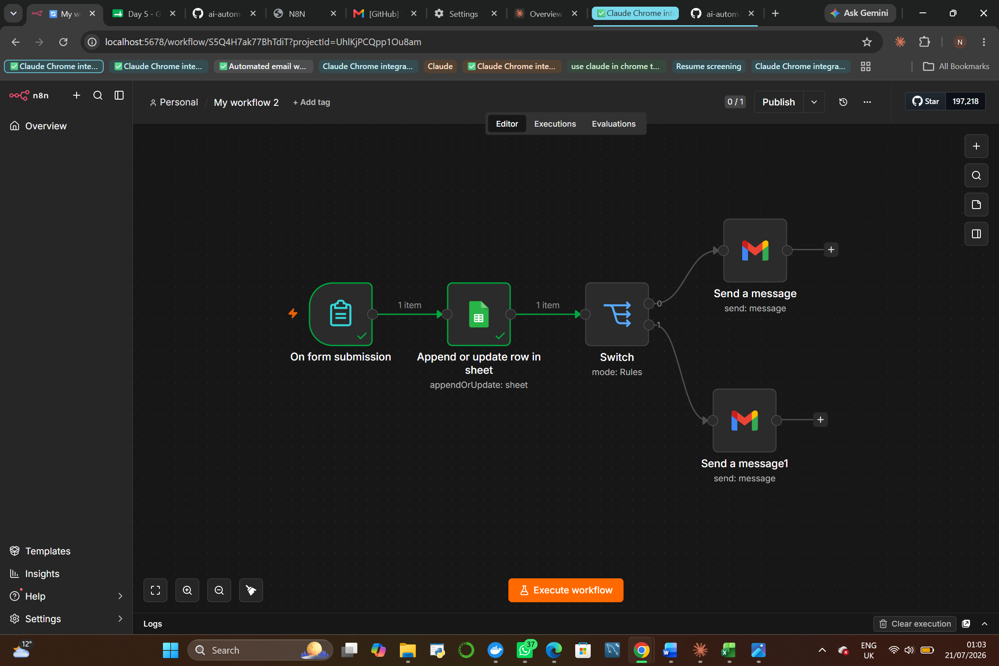
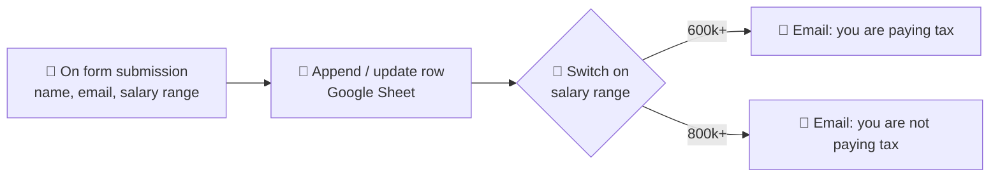

# 🌱 My First Workflow — Tax Status Notifier

   

> **This is the very first automation I ever built.** It's simple, and it has a couple of beginner quirks I've left in on purpose — because this little workflow is the reason I kept going. The moment a form submission flowed through, wrote itself to a sheet, branched on a condition, and fired off an email *entirely on its own*, something clicked. I understood that I could make software do the boring, repetitive parts for me. Everything else in this portfolio grew out of that one "it actually works!" moment.

Unlike the client systems in this repo (which I keep private for confidentiality), **this one is fully open** — the complete workflow JSON is included so anyone learning n8n can import it, poke at it, and make it their own.

---

## 📸 What it looks like

---

## 🔍 What it does

A form asks for a person's details and salary range, records them in a Google Sheet, works out a tax status, and emails the person the result — no human in the loop.

| Step | Node | What it does |
|---|---|---|
| 1 | **On form submission** | An n8n form collects First Name, Last Name, Email, and a Salary Range dropdown |
| 2 | **Append or update row in sheet** | Writes the submission to Google Sheets and sets a `Tax Status` field with a formula, matched on email so re-submissions update rather than duplicate |
| 3 | **Switch** | Routes the person down a branch based on their salary range |
| 4 | **Gmail** | Sends a personalised "your tax status" email automatically |

## 🧠 What it taught me

- **Triggers → actions**: how an event (a form submit) can kick off a whole chain of steps with no manual work.
- **Data mapping & expressions**: pulling `First Name`, `Email` etc. between nodes with `{{ }}` expressions.
- **Conditional logic**: using a Switch to make the automation *decide* instead of doing the same thing every time.
- **Third-party integrations**: wiring Google Sheets and Gmail together through OAuth.

Those four ideas are the foundation under every other project here — the AI agents, the RAG systems, the multi-channel bots. They're all just this, scaled up.

## 📥 Try it yourself

Grab the workflow and import it into your own n8n:

➡️ **[`workflows/tax-status-first-workflow.json`](../workflows/tax-status-first-workflow.json)**

**To run it:** in n8n, *Workflows → Import from File* → select the JSON. Then plug in your own **Google Sheets** and **Gmail** credentials, and point the Sheets node at a spreadsheet with columns: `First Name`, `Last Name`, `Email`, `Salary Range`, `Tax Status`. *(Credentials and my personal sheet ID have been removed — you add your own.)*

## 🛠️ Stack

n8n · Google Sheets · Gmail

---

<i>Where it all started. 🌱 · Buseko · Insight Analytics</i>

