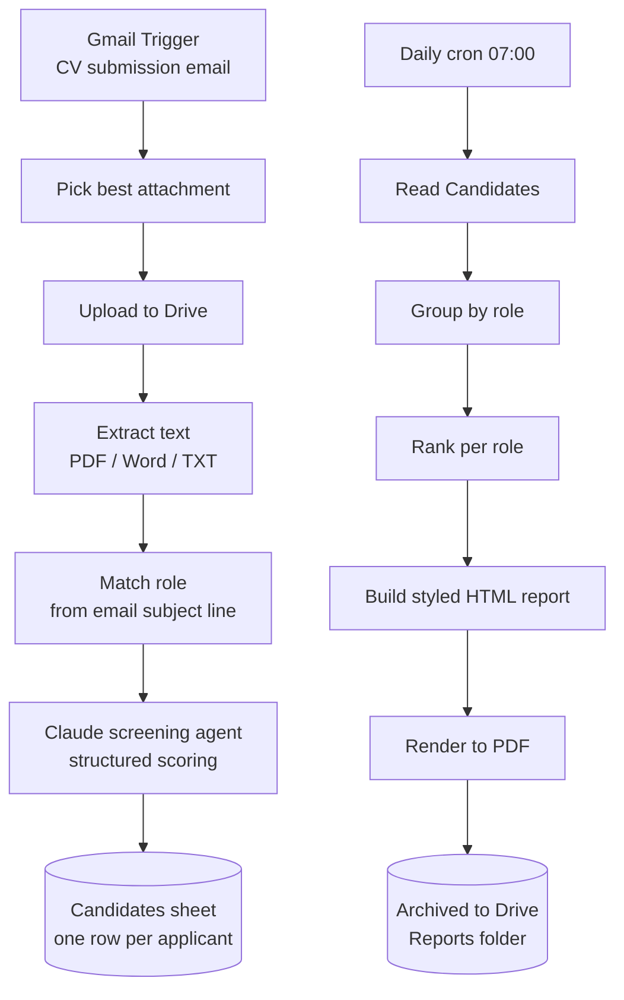

# AI CV Screening — Zega

**Client:** Zega
**What it is:** An automated resume screening pipeline that ingests applications by email, ranks candidates per role using Claude, and emails/archives a scheduled PDF shortlist report — no manual CV reading required to get to a shortlist.

## The problem

HR was manually opening every CV emailed in against open roles, reading each one, and building shortlists by hand — slow, inconsistent, and hard to scale once multiple roles were open at once.

## What I built

**Key design choices:**

- **Role matching from the subject line** using longest-match against a job requirements sheet, so "Senior Data Analyst" doesn't get mis-matched to a generic "Analyst" posting.
- **Concurrency-safe by design** — applications are processed one at a time through a batched loop so simultaneous submissions can't overwrite each other.
- **Per-job ranking**, not a global score — a candidate is ranked against others applying for the *same* role, computed live off the sheet.
- **Reports, not raw data, go out** — the daily scheduled job only emails/archives a formatted PDF shortlist (Shortlist/Maybe candidates), not the underlying spreadsheet.

## Stack

n8n · Claude (Anthropic API) · Gmail · Google Drive & Sheets · PDF rendering

## Status

Built and in go-live preparation.
