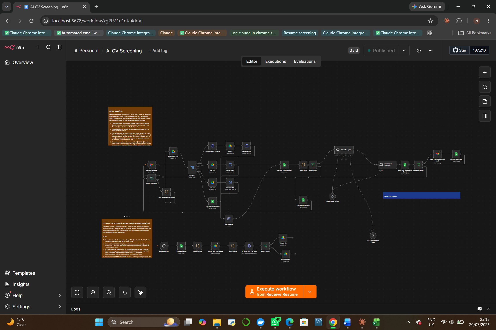
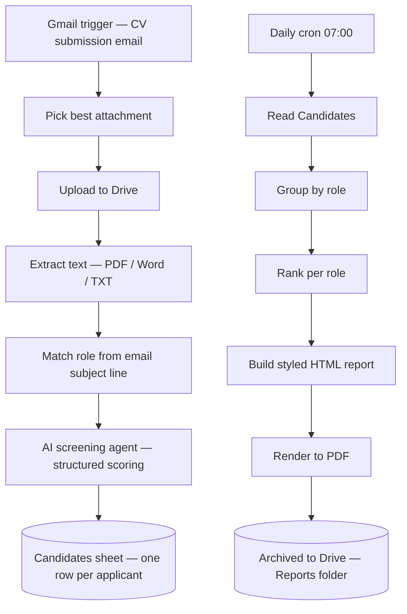

# 📄 AI CV Screening — Zega

   

**Client:** Zega
**What it is:** An automated resume-screening pipeline that ingests applications by email, ranks candidates per role using an AI agent, and archives a scheduled PDF shortlist report — no manual CV reading required to get to a shortlist.

---

## 📸 Preview — screening workflow (n8n canvas)

*Intake (Gmail) → attachment picker → Drive upload → text extraction (PDF / Word / TXT) → role match → Recruiter Agent scoring → Candidates sheet, with a companion scheduled per-role PDF report flow below.*

---

## 🎯 The problem

HR was manually opening every CV emailed in against open roles, reading each one, and building shortlists by hand — slow, inconsistent, and hard to scale once multiple roles were open at once.

## 🔍 What it does

**Key design choices:**
- **Role matching from the subject line** using longest-match against a job-requirements sheet, so "Senior Data Analyst" doesn't get mis-matched to a generic "Analyst" posting.
- **Concurrency-safe by design** — applications are processed one at a time through a batched loop so simultaneous submissions can't overwrite each other.
- **Per-job ranking**, not a global score — a candidate is ranked against others applying for the *same* role, computed live off the sheet.
- **Reports, not raw data, go out** — the daily scheduled job only archives a formatted PDF shortlist (Shortlist / Maybe candidates), not the underlying spreadsheet.

## 🛠️ Stack

n8n · Claude / OpenAI · Gmail · Google Drive & Sheets · PDF rendering

## Status

Built and in go-live preparation.
