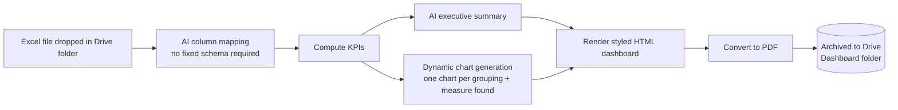

# Excel → Executive Dashboard → PDF

**Client:** Insight Analytics internal / client-facing reporting tool
**What it is:** Drop any transactional Excel file into a watched Google Drive folder and get back a fully designed executive PDF dashboard — KPIs, an AI-written summary, and auto-generated charts — with zero per-file configuration.

## The problem

Clients had raw transactional Excel exports (sales, branch performance, whatever their source system produced) but no consistent way to turn that into something a manager could actually read without opening a spreadsheet and building charts by hand every time.

## What I built

**Key design choices:**

- **No fixed template** — an AI mapping step figures out what the columns mean for *this* file, so it works across different clients' export formats without reconfiguration.
- **Fully dynamic charting** — rather than hardcoding "revenue by month," the workflow auto-detects every meaningful grouping dimension (region, payment method, sales rep, …) and numeric measure in the file and generates a chart + caption for each one.
- **Handles messy real-world spreadsheets** — headers that aren't on row 1, merged junk title rows, inconsistent layouts.
- **Self-contained output** — the PDF is generated from HTML rendered server-side, not a screenshot or a manual export, so formatting stays consistent regardless of input.

## Stack

n8n · Claude (Anthropic API) · Google Drive · HTML/CSS templating · PDF rendering

## Status

Working in production for test files; executive email delivery not yet enabled.
