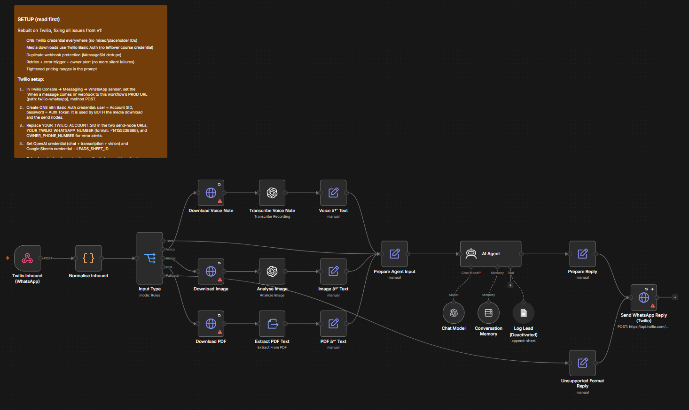
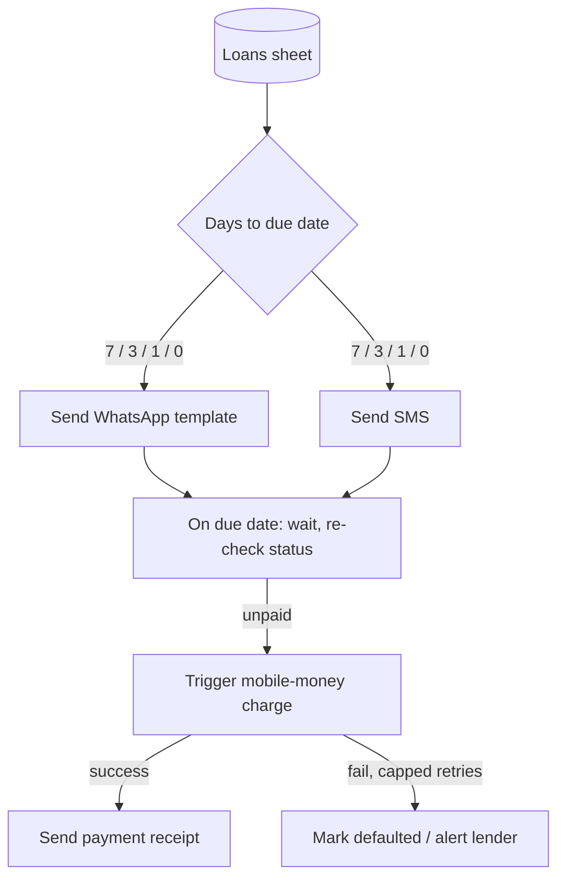
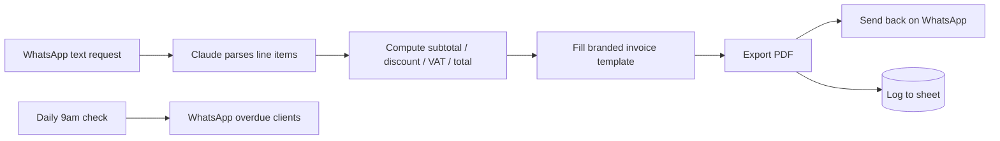

# 💬 WhatsApp Business Automation Suite

   

**Clients:** Insight Analytics & retainer clients
**What it is:** A family of WhatsApp-first automations covering loan reminders + mobile-money collection, plain-text-to-invoice generation, and reply-only AI support bots — built so a business's WhatsApp Business number does the work a person would otherwise do by hand.

---

## 📸 Preview — reply-only AI support bot (n8n canvas)

*Inbound message → type router (text / voice / image / PDF) → transcription & vision → AI Agent with memory → reply, with duplicate-webhook protection and owner error alerts.*

---

## 1. Loan reminders & mobile-money collection

Automated reminder sequence (7 / 3 / 1 / 0 days before due, then daily while overdue) sent on **both WhatsApp and SMS in parallel**, since not every borrower has WhatsApp — followed by automatic mobile-money collection attempts once a payment is due.

- Dual-channel delivery so no borrower is unreachable
- Mobile-money collection via a payments API (charge → verify → reconcile)
- Partial payments supported; capped retry attempts before flagging default
- Full activity log for audit purposes

## 2. WhatsApp invoice creator

A client texts a plain-language request ("invoice John for 3 units at K150 each, 10% discount") and gets back a branded PDF invoice on WhatsApp within seconds.

## 3. Reply-only AI support bots

Channel-native AI agents that answer inbound WhatsApp / Messenger / Instagram messages (text, voice, image, document) within the platform's session window and log every conversation as a lead. Built with duplicate-webhook protection, retry + error alerting, and a single clean credential per channel.

## 🛠️ Stack

n8n · Claude / OpenAI · WhatsApp Business Cloud API · Twilio · Meta Graph API · SMS gateway · mobile-money payment APIs · Google Sheets

## Status

Multiple variants shipped and hardened across clients; live delivery on some channels is pending Meta business verification (a client-side compliance step, not a system limitation).
