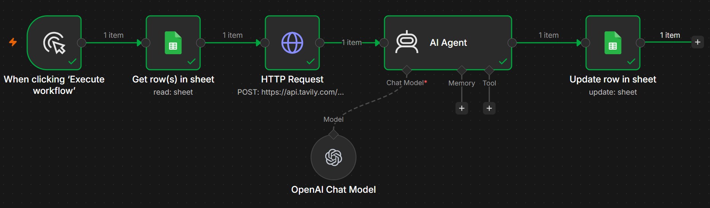
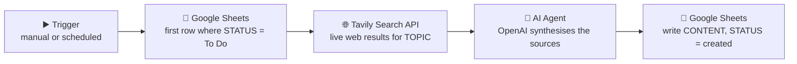

# 🔎 AI Research & Content Engine — Tavily + OpenAI

    

> **A spreadsheet becomes a content pipeline.** You type a topic into a Google Sheet and mark it `To Do`. The workflow searches the live web for that topic, reads the best sources, writes a grounded 200-word piece, drops it back into the sheet, and flips the status to `created`. No tab-hopping, no copy-paste, no blank page.

Like the tax-status workflow, **this one is fully open** — the complete JSON is included so you can import it and run it yourself.

---

## 📸 What it looks like

---

## 🔍 What it does

| Step | Node | What it does |
|---|---|---|
| 1 | **Trigger** | Kicks the run off. Manual while testing; swap in a Schedule Trigger to run it daily. |
| 2 | **Get row(s) in sheet** | Pulls the *first* row where `STATUS = "To Do"` and reads its `TOPIC`. The sheet is the queue. |
| 3 | **HTTP Request → Tavily** | `POST https://api.tavily.com/search` with the topic. Returns the top 3 sources, 3 content chunks each. |
| 4 | **AI Agent (OpenAI)** | Receives the three source extracts and writes a 200-word piece in its own words. |
| 5 | **Update row in sheet** | Writes the result to `CONTENT` and sets `STATUS = "created"`, matched on `TOPIC`. |

---

## 🧩 How Tavily and OpenAI work together

This is the heart of the project, and it's worth being precise about it, because the two tools are solving **completely different problems**.

**A language model on its own cannot do research.** It has a training cutoff, so it doesn't know what happened last week. Ask it for current information and you get one of two bad outcomes: a confident answer that is quietly out of date, or an invented one. It has no way to check.

**A search API on its own cannot write.** Search gives you links and raw text. Somebody still has to open the sources, read them, work out which parts matter, notice where they repeat each other, and turn it into prose.

Put them together and each one covers the other's weakness:

| | **Tavily** | **OpenAI** |
|---|---|---|
| Role | Retrieval | Reasoning & writing |
| Supplies | Facts, freshness, sources | Judgement, structure, language |
| Weak alone because | Returns raw text, no synthesis | No live knowledge, can hallucinate |

**Why Tavily specifically, and not a normal search engine?** Tavily is built for AI consumption rather than for humans. A standard search returns a page of blue links, and you would then have to scrape each page, strip out navigation, ads, and cookie banners, and chunk what's left. Tavily does the crawling, extraction, ranking, and chunking for you and hands back clean, relevant text. That removes an entire scraping-and-cleaning layer that would otherwise be the most fragile part of the workflow.

**What the model is actually asked to do** matters just as much. The system prompt explicitly tells it *not* to stitch the snippets together, but to find the patterns across all three sources, cut repetition, exercise judgement when sources disagree, and ignore anything that reads as outdated or clickbait. That instruction is the difference between a summary and a piece of writing.

Technically, this is **retrieval-augmented generation (RAG)** in its simplest useful form. There's no vector database and no embedding step. The retrieval layer is just live web search. For "write about a current topic," that's the right trade: the freshest possible context, with almost no infrastructure.

---

## ⏱️ Time saved

Doing this by hand, per topic, looks roughly like this:

| Task | Manual |
|---|---|
| Search and pick decent sources | 5–10 min |
| Read and pull out what matters | 10–15 min |
| Draft and edit down to 200 words | 10–15 min |
| Paste into the tracker, update status | 1–2 min |
| **Total** | **~25–40 min** |

The workflow completes the same loop in **well under a minute**, and more importantly it needs **no human attention at all** while running. You queue topics once and collect finished drafts later.

> *These manual figures are a realistic estimate of the same task done by hand, not a measured benchmark. The honest headline isn't the exact number, it's the shape of it: a task measured in tens of minutes becomes one measured in seconds.*

At a modest **20 topics a month**, that's roughly **8 to 13 hours** of research and drafting recovered. At a daily cadence it becomes the difference between "we'd like to publish consistently" and actually doing it.

---

## 💡 The value it adds

- **Consistency beats intensity.** Most content efforts die because research is tiring. Removing the tiring part is what makes a publishing habit survivable.
- **Grounded, not invented.** Every piece is written from live sources fetched seconds earlier, which directly attacks the two biggest LLM failure modes: stale knowledge and hallucination.
- **A non-technical interface.** The control panel is a Google Sheet. Anyone on the team can add topics and read drafts without touching n8n or knowing what an API is.
- **A queue with state, not a script.** The `STATUS` column turns the sheet into a simple work queue: `To Do → created`. Work is trackable, re-runnable, and never processed twice.
- **Drafts, not final copy.** It removes the blank page and the reading. A human still edits for voice and accuracy before anything is published, which is exactly where human time is worth spending.
- **A reusable pattern.** Swap the output step and the same skeleton becomes competitor monitoring, a market-research digest, or a daily industry briefing. The retrieve → reason → record shape is the transferable part.

---

## 🧠 What I learned

- **Pair tools by weakness, not by hype.** The interesting design decision wasn't "use AI," it was noticing precisely what the model *couldn't* do and choosing a tool to cover that specific gap.
- **AI-first APIs remove real work.** Choosing Tavily over roll-your-own scraping eliminated the most brittle component before it was ever written.
- **The prompt is part of the architecture.** Telling the model to synthesise rather than summarise, and to judge source quality, changed the output more than any node ever did.
- **A spreadsheet is an underrated UI.** For a small team, a sheet with a status column is a perfectly good job queue.

---

## ⚠️ Known limitations & next steps

Being honest about what isn't finished:

- **The API key belongs in a credential.** It currently sits in an HTTP header. Moving it into an n8n credential keeps it out of the workflow export entirely. *(The published JSON here has the key replaced with a placeholder.)*
- **It assumes exactly three results.** The prompt reads `results[0]`, `[1]`, and `[2]` directly, so a topic returning fewer than three sources would break. Looping over whatever comes back is the proper fix.
- **One row per run.** `returnFirstMatch` means a single topic per execution. Batching or looping would clear the whole queue in one go.
- **No source tracking.** The URLs are discarded after synthesis. Saving them to a `SOURCES` column would make every draft auditable.
- **Fixed date window.** The original search body pinned a hard-coded date range; it should be dynamic or omitted so "recent" stays recent.

---

## 📥 Try it yourself

➡️ **[`workflows/ai-research-content-engine.json`](../workflows/ai-research-content-engine.json)**

**To run it:**
1. In n8n: *Workflows → Import from File* → select the JSON.
2. Add your own **OpenAI** and **Google Sheets** credentials.
3. Get a free **Tavily** API key at [tavily.com](https://tavily.com) and replace `REPLACE_WITH_YOUR_TAVILY_API_KEY`.
4. Point both Sheets nodes at a spreadsheet with the columns: `TOPIC`, `STATUS`, `CONTENT`.
5. Add a topic, set its `STATUS` to `To Do`, and execute.

*(All credentials, API keys, and my sheet ID have been removed. You supply your own.)*

## 🛠️ Stack

n8n · Tavily Search API · OpenAI · Google Sheets

---

<i>Retrieve → reason → record. · Buseko · Insight Analytics</i>

