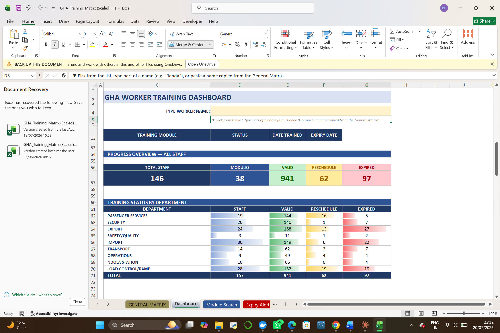
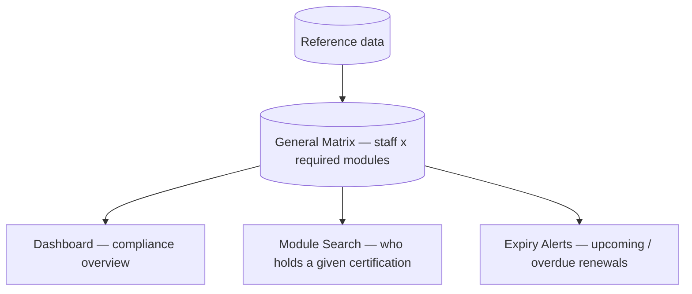

# 🎓 HR Training Compliance Matrix — Zega

  

**Client:** Zega
**What it is:** A scaled Excel system that tracks mandatory staff training / certifications against role requirements, flags expiring or overdue certifications before they lapse, and gives management a live compliance dashboard — built for a workforce where specific certifications are a hard operational / regulatory requirement (safety, security, dangerous-goods and handling qualifications tied to specific job functions).

---

## 📸 Preview — worker training dashboard

*Live compliance overview across the whole workforce — total staff, training modules, and valid / reschedule / expired counts, broken down by department.*

---

## The problem

Staff training records were tracked in a flat spreadsheet with no structure — no way to quickly see who was overdue for renewal, no per-role training-requirement mapping, and no dashboard view for management to catch compliance gaps before they became a problem.

## What I built

**Key design choices:**
- **One matrix, multiple views** — a single source-of-truth grid cross-referencing staff against every required training module, with a dashboard, a searchable module lookup, and an expiry-alert view all built as live formulas over that one grid rather than duplicated data.
- **Scaled for a larger workforce** — rebuilt from an earlier version to handle 140+ staff across 38 training modules and multiple departments without breaking down.
- **Expiry-driven, not just record-keeping** — the point isn't just storing certification dates, it's surfacing what's about to lapse *before* it becomes a compliance gap, with clear valid / reschedule / expired status per person and per department.

## 🛠️ Stack

Microsoft Excel — formula-driven matrix, conditional-format dashboard, per-department roll-ups, expiry logic.

## Status

Delivered; in monthly-update use.
