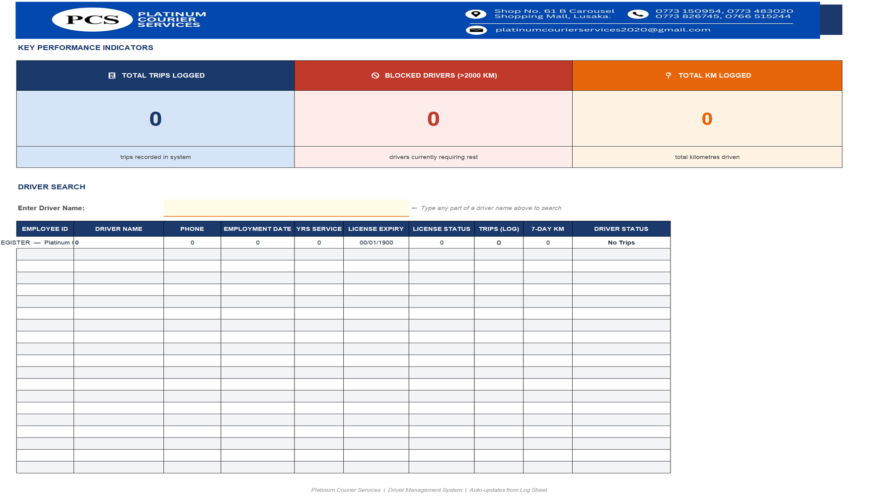
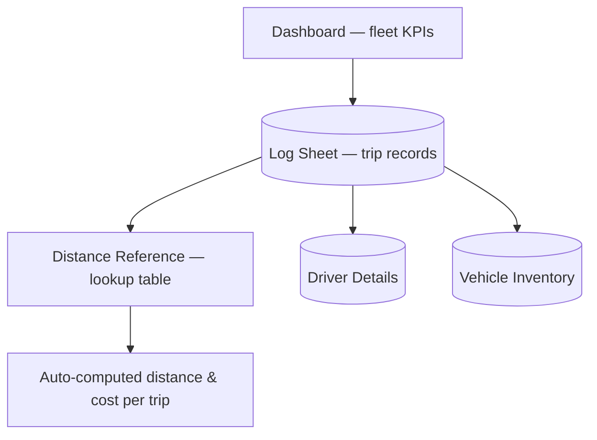

# 🚚 Fleet & Driver Management — Platinum Courier

  

**Client:** Platinum Courier Services
**What it is:** An Excel-based logistics operations system covering trip logging, driver management, vehicle inventory, and automated distance-based costing for a courier fleet.

---

## 📸 Preview — fleet dashboard

*Operational dashboard over the trip log — driver, vehicle, and distance/cost records in one workbook.*

---

## The problem

Trip logs, driver assignments, and vehicle records were kept separately with no automatic distance / cost calculation — every trip's distance and pricing had to be worked out manually against a reference table.

## What I built

**Key design choices:**
- **Distance / cost auto-calculation** — trip records pull from a distance reference table instead of manual lookup, cutting a repetitive step out of every single trip entry.
- **Single system, four views** — dashboard, trip log, driver records, and vehicle inventory all live in one workbook with consistent cross-references instead of separate untracked files.
- **Built for daily operational use**, not a one-off report — designed around how dispatch actually logs a trip in real time.

## 🛠️ Stack

Microsoft Excel — formula-driven lookups, dashboard, structured data tables.

## Status

Delivered, in production use (multiple iterations shipped as operational needs evolved).
