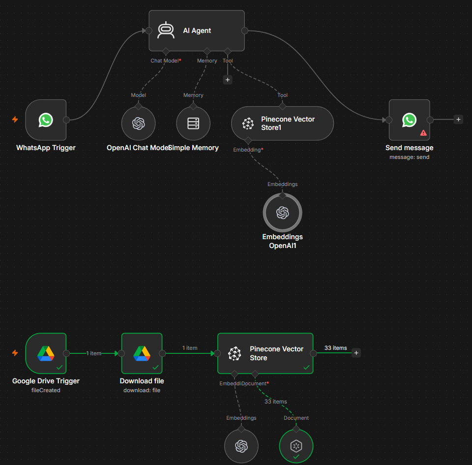
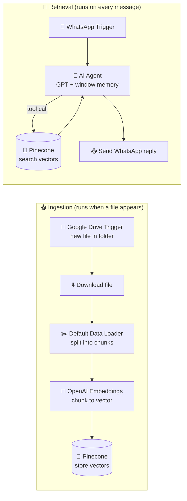

# 🧠 WhatsApp RAG Agent — Pinecone + OpenAI

    

> **Drop a document in a Google Drive folder. Ask about it on WhatsApp.** No retraining, no fine-tuning, no copy-paste into a chat window. The folder is the knowledge base, and WhatsApp is the interface. This is my first agent with a real vector database behind it.

This one is **fully open**. The complete JSON is included, credentials removed.

---

## 📸 What it looks like

Two pipelines on one canvas. The lower one files knowledge away. The upper one answers with it.

---

## 🔍 What it does

| Step | Node | What it does |
|---|---|---|
| 1 | **Google Drive Trigger** | Polls a single folder every minute for newly created files. The folder is the admin panel. |
| 2 | **Download file** | Pulls the binary by ID so the loader can read the actual document, not the metadata. |
| 3 | **Default Data Loader** | Splits the document into overlapping chunks. My first run produced **33 chunks** from one PDF. |
| 4 | **Embeddings (OpenAI)** | Turns each chunk into a vector, a list of numbers representing its meaning. |
| 5 | **Pinecone (insert mode)** | Stores the 33 vectors in a namespaced index. This is now permanent, searchable memory. |
| 6 | **WhatsApp Trigger** | Fires on an inbound message from a real phone. |
| 7 | **AI Agent** | Reads the question. Decides whether it needs to look something up. |
| 8 | **Pinecone (retrieve-as-tool)** | Attached to the agent as a **tool**, not as a fixed step. The agent calls it when it judges a lookup is needed. |
| 9 | **Simple Memory** | Keeps recent turns so follow-up questions like "and what does that cost?" still make sense. |
| 10 | **Send message** | Replies in the same WhatsApp thread. |

---

## 🧩 What RAG actually is, in plain terms

A language model knows what it read during training. It does not know your price list, your service catalogue, your policy document, or anything written after its cutoff. Ask it about your own business and it will either decline or invent an answer.

There are three ways to fix that. Two are bad ideas for most businesses:

| Approach | What it means | Why it usually fails |
|---|---|---|
| **Fine-tuning** | Retrain the model on your documents | Expensive, slow, needs redoing every time a price changes |
| **Stuffing the prompt** | Paste the whole document into every message | Hits context limits, costs more per message, and gets slower as documents grow |
| **RAG** | Store documents as searchable vectors, fetch only the relevant few lines, hand them to the model | Cheap, instant to update, scales past the context window |

RAG wins because of a simple separation: **the model does the reasoning, the database does the remembering.**

### Why embeddings, and not keyword search

A keyword search for "how much do you charge" will not find a paragraph headed "Pricing." The words do not overlap. An embedding turns text into coordinates based on meaning, so "how much do you charge" lands near "Pricing" in that space even with no shared words. That is the whole reason a vector database exists here instead of a spreadsheet lookup.

### Why the same Pinecone index appears twice

This confused me at first, and it is the key idea in the build. One node **writes**, the other **reads**:

- **Insert mode** (lower pipeline) runs rarely, only when a document arrives. It is the librarian shelving books.
- **Retrieve-as-tool** (upper pipeline) runs on every message. It is the reader looking one up.

They are two operations on one shared brain. And because retrieval is wired as a **tool** rather than a fixed step, the agent decides for itself when to search. "Hello" gets a direct reply. "What does your Power BI training cover?" triggers a lookup. That decision is the difference between a chatbot and an agent.

### How this differs from my last build

My [AI Research & Content Engine](04-ai-research-content-engine.md) was also RAG, but the retrieval layer was live web search. Fresh context, no infrastructure, nothing remembered. This build is the other half of the idea: **private knowledge, stored permanently, searched by meaning.** Web search answers "what is happening in the world." A vector database answers "what does *this business* say." Most useful systems eventually need both.

---

## 🇿🇲 Why this matters for Zambian business

Three things are true at the same time here, and together they make this pattern unusually well suited to the market.

**1. WhatsApp is already the customer service channel.** Zambian businesses do not need to persuade customers to install an app or visit a portal. Enquiries already arrive on WhatsApp. A system that answers there meets people where they are, which removes the adoption problem that sinks most business software locally.

**2. The knowledge exists, but it is trapped.** Most SMEs already have the answers written down somewhere: a price list, a services PDF, a policy document, a proposal template. The problem is not that the information is missing. It is that retrieving it depends on one person being awake, available, and not on leave. When that person is busy, the customer waits. When they leave the company, the knowledge leaves too.

**3. The repetitive questions dominate.** Opening hours. Prices. Locations. Requirements. Turnaround times. The same handful of questions, answered manually, every day. That work is real, it consumes hours, and none of it needs judgement.

A RAG agent addresses all three at once. It answers instantly, at any hour, from documents the business already wrote. Updating it is not a software project. It is dropping a new PDF into a folder.

The wider point is about who gets to build this. A system like this used to require a machine learning team and a serious budget. Today the vector database has a free tier, the model is charged per message, and the orchestration is a workflow one person can build in an evening. That shift matters more in Lusaka than it does in London, because it means a Zambian SME can now deploy the same class of system as a company a hundred times its size. The constraint has moved from capital to understanding. Understanding is something we can build locally.

I would be dishonest to oversell it. This does not replace anybody. It handles the repetitive layer so that the humans in a business spend their time on the questions that genuinely need a human: negotiation, judgement, and the awkward exceptions. That is a better use of a skilled employee than typing out opening hours for the twentieth time.

---

## 🌱 What this means for my own growth

This is the first system I have built that has a **memory of its own**, and that is a real line to cross.

Looking at the progression in this repo honestly:

| Build | What I could do afterwards |
|---|---|
| Tax status notifier | Move data between services on a condition |
| WhatsApp automation suite | Reach customers on the channel they actually use |
| AI CV screening | Get a model to make a structured judgement |
| Research engine | Ground a model in information it was never trained on |
| **This build** | **Give a model permanent, private, searchable knowledge** |

Every earlier build passed data through a workflow. This one **stores** it and searches it later, which is the point where the work stops being automation and starts being architecture. Embeddings, vector indexes, namespaces, chunking, tool-calling agents: these are the concepts underneath most of what is currently called AI in business, and I now understand them because I wired them up and watched them break rather than because I read about them.

Concretely, it changes what I can offer clients. Before this, an AI enquiry meant "a bot that follows rules I write." Now it means "a bot that knows what your business knows." That is a different conversation, and a considerably more valuable one.

It also fits an ambition I am not shy about: I want Insight Analytics to be the company Zambian businesses think of first when they need data and automation done properly. Nobody earns that by talking about AI. You earn it by building the systems, being honest about what they do and do not do, and publishing the work so it can be checked.

---

## 🧠 What I learned

- **Retrieval as a tool beats retrieval as a step.** Forcing a database lookup on every message wastes calls and produces stiff replies. Letting the agent decide is both cheaper and more natural.
- **Chunking is a design decision, not a default.** Too small and a chunk loses its context. Too large and the retrieved passage is mostly noise. This is the dial that most affects answer quality.
- **The embedding model must match on both sides.** Text embedded with one model and queried with another lands in a different coordinate space, so the search silently returns nothing useful. Same model in, same model out.
- **Namespaces are how one index serves many clients.** One Pinecone index, one namespace per business, and their data never mixes. That is what makes this pattern viable as a service rather than a one-off.
- **"It ran green" is not "it works."** Every node in the ingestion branch succeeded on the first try. Getting the retrieval side to actually answer from those 33 chunks was where the real learning was, and the section below is the honest state of it.

---

## ⚠️ Known limitations & next steps

This is a first working build, not a finished product. What still needs doing:

- **Namespace mismatch between write and read.** The insert node writes into a named namespace, but the retrieval tool queries the index default. Same index, different drawer, so a search can come back empty even though the vectors are stored. Both sides must name the same namespace. This is the first thing to fix and a good example of a bug that reports success at every node.
- **The agent has no system prompt.** With no instructions it answers as a general assistant rather than as one business's representative. It needs a prompt that sets its role, its tone, and a hard rule to answer only from retrieved context and to say plainly when it does not know.
- **Memory is shared across all senders.** A single window buffer with no session key means every WhatsApp contact shares one conversation history. The session key must be the sender's phone number so conversations stay separate.
- **The reply node needs its fields wired.** Recipient and message body must be mapped from the trigger and the agent output before this runs unattended.
- **No source citation.** The agent answers without saying which document the answer came from. Returning the source file makes every answer auditable, which matters a great deal for prices and policies.
- **Ingestion is create-only.** The trigger fires on new files, so an edited document is never re-indexed and a deleted one leaves stale vectors behind. Handling updates and deletions is required before anyone relies on it.
- **No handover to a human.** Any real deployment needs a clear route to a person when the agent is uncertain or the customer asks for one.

---

## 📥 Try it yourself

➡️ **[`workflows/whatsapp-rag-agent.json`](../workflows/whatsapp-rag-agent.json)**

**To run it:**
1. In n8n: *Workflows → Import from File* → select the JSON.
2. Add your own **OpenAI**, **Google Drive**, **Pinecone**, and **WhatsApp Business Cloud** credentials.
3. Create a Pinecone index sized to your embedding model, then set it on **both** Pinecone nodes and give both the same namespace.
4. Point the Google Drive Trigger at a folder you will drop documents into.
5. Drop in a PDF and watch the ingestion branch run. Check the vector count in the Pinecone console.
6. Give the AI Agent a system prompt, wire the reply fields, then message the connected WhatsApp number.

*(All credential IDs, my Drive folder ID, index name, and namespace have been replaced with placeholders. You supply your own.)*

## 🛠️ Stack

n8n · Pinecone · OpenAI (embeddings + chat) · Google Drive API · WhatsApp Business Cloud API

---

<i>Store → search → answer. · Buseko · Insight Analytics</i>

