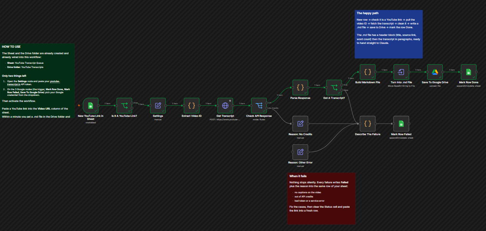
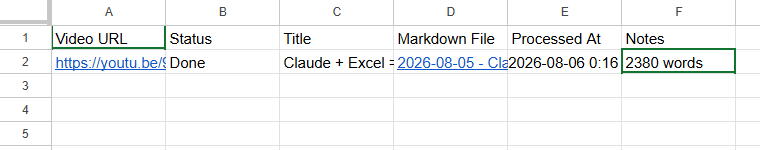
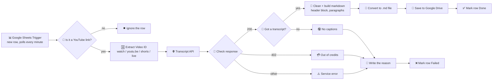

# 📼 YouTube to Markdown — A Research Inbox for an AI Assistant

    

> **Paste a YouTube link into a spreadsheet. Get a clean markdown transcript in Drive, ready to hand to an AI assistant.** A one hour tutorial becomes a 2,380 word file I can read, search, or feed to Claude in seconds.

This one is **fully open**. The complete JSON is included, credentials removed.

---

## 📸 What it looks like

One line for the happy path, one branch for every way it can fail. The run above finished in **6.98 seconds**.

And the result, written straight back into the sheet I pasted the link into:

Status, title, a link to the file, a timestamp and a word count. I never open n8n to check whether it worked.

---

## 🧨 The problem this solves

I learn a lot from long technical videos. Power BI walkthroughs, n8n builds, conference talks. The useful part is usually eight minutes buried inside fifty.

Before this, working through one meant watching at 1.5x with a notepad open, scrubbing back when I missed something, and ending up with notes that were worse than the source. Worse still, once the video was watched it was effectively gone. I could not search it, quote it, or ask a question about it later.

Text does not have that problem. Text can be searched, quoted, summarised and handed to an AI assistant. So the real job was never "transcribe a video." It was **convert a video into something I can think with.**

The friction had to be near zero, or I would not use it. Not a script to run, not a site to log into. Paste a link, carry on with what I was doing, and find the file waiting.

---

## 🔍 What it does

| Step | Node | What it does |
|---|---|---|
| 1 | **Google Sheets Trigger** | Polls one sheet every minute for a newly added row. The spreadsheet is the whole interface. |
| 2 | **Is It A YouTube Link?** | Regex guard so a blank row or a stray note never reaches the paid API. |
| 3 | **Settings** | One node holding the API token and the Drive folder ID, so nothing is buried in node parameters. |
| 4 | **Extract Video ID** | Pulls the 11 character ID out of `watch?v=`, `youtu.be/`, `/shorts/`, `/live/` or `/embed/`. Any link I copy from any device works. |
| 5 | **Get Transcript** | Calls youtube-transcript.io. Set to full response, never error, so a failure returns data instead of blowing up the run. |
| 6 | **Check API Response** | Switch on the status code. 200, 402 out of credits, and everything else each get their own path. |
| 7 | **Parse Response** | Handles the four shapes this API has returned over its life, including a `tracks[].transcript[]` array of segments. |
| 8 | **Build Markdown File** | Decodes HTML entities, strips `[Music]` and `[Applause]`, then regroups the text into paragraphs and writes a header block. |
| 9 | **Convert to File** | Turns the markdown string into a real `.md` binary. |
| 10 | **Save To Google Drive** | Uploads to a fixed folder, named `YYYY-MM-DD - Video Title.md`. |
| 11 | **Mark Row Done / Failed** | Writes the outcome back into the row the link came from. |

---

## 🧩 The design decisions that actually mattered

### A spreadsheet is a better front end than a form

I started to build a form trigger. Then I realised a sheet gives three things a form does not: a place to paste links in bulk, a permanent record of everything processed, and somewhere for the workflow to write its answer back. The interface and the log are the same object.

That last point is the one I would repeat on any build. **A workflow that reports its result where the request came from does not need monitoring.**

### Deliberately no AI in the pipeline

The obvious move is to drop a model in and have it summarise. I decided against it, and the reasoning is worth stating.

A summary is a decision about what matters, made before I know what I am looking for. If a model condenses a fifty minute video to ten bullet points, the thing I actually needed is often in the ninety percent it discarded, and I have no way of knowing what was lost.

Keeping the full text means the summarising happens **later, with a question attached.** I hand the file to Claude and ask something specific. Same model, far better answer, because the context is complete and the question came first.

It is also free. No tokens are spent turning a video into text, only when I ask something about it.

### Structure without interpretation

The raw API returns one unbroken block, sometimes thousands of words with no punctuation breaks. Unreadable for a human, and awkward for a model.

So the workflow adds structure but never changes meaning: HTML entities decoded, `[Music]` markers removed, whitespace collapsed, sentences regrouped into paragraphs of five, and a header block on top with the title, source URL, channel, word count and date.

Every one of those is reversible formatting. Nothing is summarised, reordered or dropped. The file is the transcript, just legible.

### Failure has to be visible where I am looking

The first version of the error handling used **Stop and Error** nodes, which is what the template I started from did. That is honest inside n8n and useless outside it, because I would have to open n8n to discover anything went wrong.

Every failure path now converges on one node that writes a plain English reason into the Notes column of the same row. No captions on the video. Out of API credits. Bad token. I see it in the sheet, next to the link that caused it, without opening anything.

---

## ⚡ What it actually changes for me

The honest measure is not seconds saved per run. It is that a class of work moved from "I should get round to that" to "done in the background."

- A long tutorial goes from **an hour of divided attention to a 7 second job** I do not watch.
- Transcripts are **searchable and quotable**. I can find the two minutes where someone explains a specific node.
- Videos become **input for an assistant**. I paste a transcript to Claude and ask what applies to a client problem. That was not possible when the content only existed as sound.
- Because pasting a link costs nothing, I now queue up videos I would previously have skipped. **Lowering the cost of an action changes how often you take it**, which is the part I did not anticipate.

It also matters for client work. Recorded training sessions, webinars and stakeholder interviews are all the same shape of problem: valuable content locked in a format nobody can search. The pattern transfers directly.

---

## 🧠 What I learned

- **Copy an API's error paths, not just its success path.** Wiring 402 separately from a generic error took ten extra minutes and turns "it broke" into "top up the account."
- **Never trust one response shape.** This API has returned `text`, `transcript`, an array of segments, and a nested `tracks[]` structure. Parsing defensively for all four costs nothing and saves a debugging session.
- **Green does not mean working.** My first two runs finished in 83ms and 44ms and reported success. Both did nothing, because my headers had gone into one cell instead of six and the guard node quietly sent every row down the false branch. **A suspiciously fast success is a failure that has not identified itself.** Run time is now the first thing I check.
- **Put the config in one node.** Token and folder ID sit in a single Settings node. Anyone importing this edits one place instead of hunting through eleven nodes.
- **The boring interface wins.** A Google Sheet is not impressive. It is also the reason I use this every day, because pasting a link into a spreadsheet is something I would do anyway.

---

## ⚠️ Known limitations & next steps

- **Captions only, no real transcription.** The API reads captions that already exist. A video with captions disabled fails and no amount of retrying will fix it. A Whisper fallback for those cases is the obvious next build.
- **Paid per lookup.** youtube-transcript.io runs on credits. Fine at my volume, worth costing properly before pointing a large backlog at it.
- **Row Added only fires forward.** The trigger tracks the last row it saw, so pre-existing rows are never picked up and clearing a Status cell does not reprocess anything. You add a new row to retry.
- **No deduplication.** Paste the same link twice and it transcribes twice, spending credits twice. A lookup against existing rows before the API call would fix that.
- **Auto-captions carry their errors through.** Names, acronyms and Zambian place names are frequently wrong in YouTube's auto-captions, and this workflow faithfully preserves those mistakes. Fine for research, not for quotation.
- **Long videos are one long file.** A three hour talk produces a single large markdown file. Chunking by timestamp would make navigation far easier.
- **No timestamps in the output.** The segment timings are discarded during cleaning. Keeping them would allow jumping back to the exact moment in the video, which is the feature I most want next.

---

## 📥 Try it yourself

➡️ **[`workflows/youtube-transcript-to-markdown.json`](../workflows/youtube-transcript-to-markdown.json)**

**To run it:**
1. Create a Google Sheet with these headers in row 1: `Video URL`, `Status`, `Title`, `Markdown File`, `Processed At`, `Notes`. Type them into six separate cells, one per column.
2. Create a Google Drive folder for the output files.
3. In n8n: *Workflows → Import from File* → select the JSON.
4. Open the **Settings** node. Add your [youtube-transcript.io](https://www.youtube-transcript.io) API token and your Drive folder ID.
5. Put your Sheet URL on the trigger, **Mark Row Done** and **Mark Row Failed**.
6. Pick your Google credential on all four Google nodes. Note the trigger needs its own **Google Sheets Trigger** credential, which is a different type from the regular Sheets one because it also needs Drive scopes.
7. Activate, then paste a YouTube link into the **Video URL** column.

*(My Sheet URL, Drive folder ID and API token have been replaced with placeholders. You supply your own.)*

## 🛠️ Stack

n8n · Google Sheets API · Google Drive API · youtube-transcript.io · Markdown

---

<i>Paste a link → get something you can think with. · Buseko · Insight Analytics</i>

