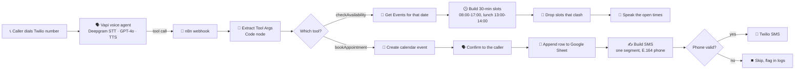

# ☎️ Insight Dentist — An AI Receptionist That Answers the Phone

     

> **A patient rings a real phone number. A voice answers, offers the times that are actually free, books the appointment, and a confirmation SMS lands before they put the phone down.** No human touches it.

This one is **fully open**. The complete n8n JSON is included, credentials removed.

The clinic is a demo. The phone call is not.

---

## 🧨 The problem this solves

A dental clinic misses calls. The front desk is with a patient, it is lunchtime, it is Saturday afternoon, the phone rings out. Every missed call is a patient who rings the next clinic on the list.

The calls themselves are not complicated. Roughly nine in ten are the same four questions: *where are you, what does it cost, when are you open, can I book*. That is a script. What it needs is somebody available to say it at nine at night, which is exactly the thing a receptionist cannot be.

So the job was not "build a chatbot". It was **answer the phone, know the diary, and write the booking somewhere real.**

---

## 🔍 What it does

Vapi handles the call: speech in, speech out, and deciding when to reach for a tool. n8n is the part that actually knows things, checking the calendar and writing the booking. Twilio is the phone line and the SMS.



| Step | Node | What it does |
|---|---|---|
| 1 | **Webhook VAPI** | Single entry point. Both tools post here; the payload says which one. |
| 2 | **Extract Tool Args** | Code node that pulls the tool arguments out of Vapi's payload. Exists because n8n's expression sandbox refuses to read the property they arrive in. See the failures below. |
| 3 | **Route by Tool** | Switch on the tool name into the availability branch or the booking branch. |
| 4 | **Get Events** | Google Calendar, filtered to the requested day with an explicit `+02:00` offset. `Always Output Data` is on, or a free day kills the branch. |
| 5 | **Find Slots** | Builds every 30 minute slot in clinic hours and skips the lunch hour. |
| 6 | **Filter for Free Slots** | Drops any slot overlapping an existing event, then writes a sentence a person can say out loud. |
| 7 | **Respond with Availability** | Returns the sentence to Vapi in the `results[].result` shape it expects. |
| 8 | **Book Appointment In Calendar** | Creates the event. Start and end both carry `+02:00`, which matters more than it sounds. |
| 9 | **Booking Confirmation** | Responds to the caller first, so the SMS never delays the conversation. |
| 10 | **Append row in sheet** | Logs the booking. Set to continue on error so a Sheets outage cannot break a live call. |
| 11 | **Build SMS** | Formats the date for humans, normalises the phone to E.164, and trims the message to one segment. |
| 12 | **Phone Looks Valid?** | Gate. A misheard number is skipped and left visible in the logs rather than failing silently at Twilio. |
| 13 | **Send Confirmation SMS** | Twilio. Retries once, continues on error. |

---

## 💣 Eight things that broke

This is the part worth reading. The demo took an afternoon; these took the rest of it.

### 1. n8n refuses to read Vapi's tool arguments

Vapi sends tool parameters at `body.message.toolCalls[0].function.arguments`. n8n's expression sandbox throws:

```
Cannot access "arguments" due to security concerns
```

Bracket notation did not help. Nor did splitting the string (`["argu"+"ments"]`). The block is on the data proxy, not the syntax, so anything that resolves to that property name is refused.

**Fix:** do it in a Code node, which gets plain JavaScript objects, and find the key by elimination so the word never appears:

```js
const fn = call.function || {};
const argsKey = Object.keys(fn).find(k => k !== 'name');
const a = (argsKey ? fn[argsKey] : {}) || {};
```

### 2. The agent did not know what day it was

Asked to book "next week", it confidently booked **16 October 2023**. Three years in the past, and not even the weekday it claimed.

An LLM has no clock. It was not reasoning badly, it was guessing, and it stated the guess with total confidence on a live call.

**Fix:** inject the real date at the top of the system prompt, using Vapi's Liquid token, and guard against past dates in the workflow as a backstop.

```
Right now it is {{"now" | date: "%A, %d %B %Y, %H:%M", "Africa/Lusaka"}} in Lusaka.
```

Treat this as mandatory for any agent that books, quotes, or schedules anything.

### 3. An empty day silently killed the branch

Google Calendar's *Get Many* returns no items when nothing is scheduled. With no items, downstream nodes never run, the webhook returns an empty body, and the agent says nothing at all. A completely free diary looked identical to a broken workflow.

**Fix:** `Always Output Data` on the calendar node.

### 4. The booking failed because the end time was before the start

Start was written as `2026-09-09T10:00:00` with no offset, so it was read in the server's timezone, while the end carried `+02:00`. The end landed before the start and Google rejected it:

```
Bad request - The specified time range is empty
```

**Fix:** an explicit `+02:00` on both ends, and the workflow timezone set to `Africa/Lusaka`.

### 5. Localhost cannot receive the tool calls

Vapi calls the tools from its own servers, so a local n8n is unreachable. A quick tunnel solves it, but the default QUIC transport was killed repeatedly on an intercepting corporate network:

```
control stream encountered a failure while serving
```

**Fix:** force HTTP/2.

```bash
cloudflared tunnel --url http://localhost:5678 --protocol http2
```

The free URL rotates on every restart and both tools have to be re-pointed, so this is a demo tool, not a production one.

### 6. Boosting the transcriber corrupted ordinary speech

Zambian names were being mangled, so I loaded 35 of them into Deepgram nova-2 as keywords at boost weight 2. The names improved. Everything else got worse:

> "Let me confirm your **Mumba**" (number)
> "I'll send the reminder via **Tembo**" (text)
> "on **Kunda**, the 7th of September" (Monday)

Short names collide with common English words, and the booster happily substituted them mid-sentence.

**Fix:** nova-3, no boost weights, and only distinctive terms that cannot collide. Mumba, Tembo, Kunda, Banda, Daka, Zulu and Ngoma stay out of the list.

### 7. A two-segment SMS vanished while Twilio said "Delivered"

The confirmation SMS never arrived on a Zambian handset. The Twilio console showed **Delivered**. The same content rebuilt as a single segment arrived immediately, and also showed **Delivered**.

The carrier was acknowledging the message and dropping it. Nothing in the logs said so.

Twilio's trial prefix eats about 37 of the 160 characters, so the real body budget is around 120. The build now trims the name and drops trailing detail rather than letting a long treatment name push it over.

**Watch segment count, not delivery status.**

### 8. It misheard a phone number and the caller agreed anyway

On a live call the agent slipped an extra zero into the number, read it back wrongly, and the caller said "perfect" without counting. A ten digit `0966011223` became an eleven digit `09660011223`, and the unroutable `+2609660011223` failed quietly behind the continue-on-error setting.

**Fix, two parts.** The prompt now states that a Zambian mobile is exactly 10 digits starting with 0, and to re-ask rather than read back a number of the wrong length. A validation gate then blocks anything failing `/^[79]\d{8}$/`.

It deliberately does **not** auto-correct. Silently "fixing" a patient's phone number is worse than flagging it.

---

## 🧠 What I would tell someone building their first voice agent

**The voice part is the easy part.** Speech in and speech out is a configuration screen. Everything hard lives in the gap between what the model believes and what is true: the date, the diary, the phone number, whether the message actually arrived.

**Confident wrong answers are the real failure mode.** Every serious bug here was silent. The agent booked a 2023 date and said it warmly. It confirmed a booking whose SMS never sent. It read back a phone number the caller rubber-stamped. Nothing errored. A demo will not surface any of this, only a real call with a real handset will.

**Design so a failure downgrades instead of collapsing.** The Sheets node and the SMS node both continue on error, because a logging problem should never take down a phone call. But the phone gate does the opposite and refuses to proceed, because a wrong number is worse than no number.

**Test in the market you are building for.** Two-segment SMS to Zambian carriers, US long codes being filtered, callers reading numbers as `097...` rather than `+260...`. None of that appears in the documentation.

---

## ⚠️ Known limitations and next steps

- **The tunnel is not production.** A free cloudflared URL changes on restart and the machine must be awake. A named tunnel or hosted n8n is required before a real clinic uses this.
- **No reschedule or cancel.** Only check availability and book. Both would need lookup-by-phone plus update and delete branches.
- **No reminder job yet.** The instant confirmation is built; a 24-hour-ahead reminder reading the sheet is not.
- **SMS deliverability is a US long code.** Fine for a demo. For real volume in Zambia, a provider with local routes into MTN, Airtel and Zamtel, or WhatsApp, which is what patients here actually use.
- **Zambian names are still imperfect.** The agent confirms what it heard and asks for a spelling on the second miss, which is the honest mitigation rather than a fix.
- **No human handoff wired.** The prompt offers to transfer; there is no number behind it.
- **One calendar, no dentist selection.** A real clinic has several chairs and several practitioners.

---

## 📥 Import it

1. **n8n:** Workflows → Import from File → `workflows/insight-dentist-voice-agent.json`.
2. Connect a **Google Calendar** and a **Google Sheets** credential, and replace `REPLACE_WITH_GOOGLE_SHEET_ID`. The sheet needs a tab with the header row `Name | Phone | Patient Type | Reason | Date | Time | Booked At`.
3. Connect a **Twilio** credential and replace `REPLACE_WITH_TWILIO_NUMBER`.
4. Publish the workflow and copy the production webhook URL. If n8n is local, expose it: `cloudflared tunnel --url http://localhost:5678 --protocol http2`.
5. **Vapi:** create an assistant, set the model to OpenAI GPT-4o, and paste the system prompt. Create two function tools, `checkAvailability` and `bookAppointment`, both pointing at the webhook URL.
6. Import a Twilio number into Vapi and set its inbound assistant. The import form leaves the assistant unset, which is a common reason a number connects but nobody answers.

Configuring Vapi through its REST API is faster and repeatable: `POST /tool` for each tool, then `PATCH /assistant/<id>` with `model.toolIds`. Use the **private** key; the public one returns 401.
