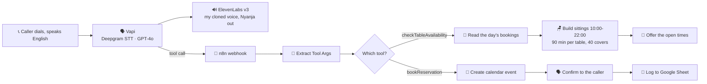

# 🇿🇲 Zam Eat — A Restaurant Phone Agent That Answers in Nyanja, In My Own Voice

     

> **You ring a Lusaka restaurant. A Zambian voice answers in Nyanja, tells you what is on the menu, quotes the price of nshima with T-bone, gives you directions past Manda Hill, and books your table into a live calendar.**
>
> **The voice is mine. I cloned it from 101 seconds of audio.**

The n8n workflow is included in full, credentials removed.

---

## 🧨 Why this one is different

The first voice agent I built ([Insight Dentist](07-insight-dentist-voice-agent.md)) worked, but it spoke English with an American voice and mangled the few Nyanja phrases in its script. It said **"Muly Buanji"** instead of *Muli bwanji*. Every Zambian who heard it winced.

That is the gap this build closes. Not a better English agent. A phone agent that sounds like it is actually from here.

Two things had to be true:

1. The voice had to be Zambian. Not "African accent" from a stock voice library, actually Zambian.
2. The Nyanja had to be real Nyanja, the town Nyanja people speak in Lusaka, not textbook Chichewa from a translation model.

---

## 🔍 What it does



| Step | Node | What it does |
|---|---|---|
| 1 | **Webhook VAPI** | One entry point. Both tools post here. |
| 2 | **Extract Tool Args** | Code node that pulls the tool arguments out of Vapi's payload, because n8n's expression sandbox refuses to read the property they arrive in. |
| 3 | **Route by Tool** | Switch into the availability branch or the booking branch. |
| 4 | **Get Reservations** | Google Calendar for that day, explicit `+02:00`, Always Output Data on. |
| 5 | **Build Sittings** | Every 30 minutes from 10:00, last sitting 90 minutes before close. |
| 6 | **Filter Free Sittings** | Counts **covers, not tables**, against a 40 seat room, by reading the party size out of each event title. |
| 7 | **Respond Availability** | Returns a sentence a person can say out loud. |
| 8 | **Book Table** | Creates the event, 90 minute booking, Africa/Lusaka. |
| 9 | **Reservation Confirmation** | Responds to the caller first, so logging never delays the conversation. |
| 10 | **Log Reservation** | Appends the row. Continues on error, because a spreadsheet problem must never break a live call. |

---

## 🎙️ The voice clone

**ElevenLabs Instant Voice Clone, from 1 minute 41 seconds of audio.**

The recording was not random speech. It was written to teach the clone two things at once:

- **English receptionist lines**, to set a calm phone-answering delivery rather than a reading-aloud voice
- **The actual Nyanja lines the agent would use**, so it learned how those sounds are really produced

That second part matters more than the length. A clone learns pronunciation from what it hears, and Nyanja phonetics are not in any stock English voice.

Settings that made a difference:

| Setting | Value | Why |
|---|---|---|
| `model` | `eleven_v3` | The only model in Vapi that supports Chichewa |
| `similarityBoost` | 0.95 | Pulls output toward the source recording |
| `stability` | 0.45 | Lower keeps the accent, higher flattens it |
| `useSpeakerBoost` | on | Improves resemblance |
| `optimizeStreamingLatency` | 4 | Maximum, because v3 is not built for realtime |

---

## 💣 What broke, and what it taught me

### 1. Speaking a language and understanding it are completely separate problems

This is the finding I would most want another builder to take away.

**ElevenLabs v3 supports Chichewa, so the agent can speak Nyanja.** No mainstream speech-to-text supports Nyanja at all. Deepgram covers European and Asian languages. Whisper lists Nyanja but is unreliable on low-resource Bantu languages.

So the agent **speaks Nyanja fluently and cannot understand a word of it.**

Rather than pretend otherwise, the demo is built around it: **the caller speaks English, the agent replies in Nyanja.** That is an honest design that works today, instead of a two-way Nyanja agent that would fail on air.

Bemba and Shona are not supported by the TTS at all, so they were dropped rather than faked.

### 2. The model cannot read its own Nyanja

The agent kept re-asking questions that had already been answered. It looked like a memory problem. It was worse than that.

Vapi transcribes the assistant's own audio back into the conversation history using the same English transcriber. Its Nyanja lines came back as gibberish:

```
AI: Chili Namachimyawa. Done. 10 13.
AI: Nibantu Bangatibame Nibabuel.
```

The model genuinely could not see what it had asked, so it asked again.

**Adding a "never ask twice" instruction did nothing**, because prose cannot compete with corrupted context. The fix was structural: five named slots, and one rule.

```
GUESTS · DAY · TIME · NAME · PHONE

Work out which slots you already have.
Ask only for a slot that is still empty.
Never ask for a slot you already have.
```

Plus worked examples, including a caller who fills three slots in one sentence, and temperature dropped to 0.2.

**Lesson: when a model behaves inconsistently, check what it can actually see before rewriting instructions.**

### 3. Asked for a price, it read out the menu

A caller asking "how much is the T-bone" wants a number. It listed dishes instead. Fixed with an explicit rule that a price question gets a price and nothing else, never a menu, backed by worked examples.

Small bug, but it happened during a live demonstration in front of people, which is the real lesson: **test the conversation, not just the plumbing.** The workflow was flawless throughout. The failure was entirely in how the agent talked.

### 4. It started saying times in Chewa

"Ten in the morning" came out in Chewa numerals. Charming, useless. Now a hard rule: every number, time, day, date and price is spoken in **English**, inside otherwise Nyanja sentences. That is how Lusaka speakers say them anyway, and a misheard booking time is the worst outcome on the call.

### 5. Boosting the transcriber for one language broke another

Zambian names were loaded into Deepgram as keywords to help recognition. On an agent where the caller only ever speaks English, those keywords corrupted plain English instead. They were removed.

Earlier, on the dentist build, the same technique made the agent say **"confirm your Mumba"** instead of "number" and **"on Kunda the 7th"** instead of "Monday". Keyword boosting is a sharp tool and it cuts both ways.

### 6. ElevenLabs API keys are restricted by default

Vapi rejected the key with `Couldn't Validate 11labs Credential ... status code 400`. The key was fine. In the Create API Key dialog, **"Restrict Key" is ON by default and every endpoint defaults to No Access**, including Text to Speech. Turn the restriction off, or grant Text to Speech explicitly.

### 7. The model that would be perfect is not reachable

ElevenLabs sells **v3 Conversational**: 70+ languages, around 280ms, half the price of v3. Exactly right for a phone agent in Nyanja.

Vapi does not expose it. It accepts only `eleven_multilingual_v2`, `eleven_turbo_v2`, `eleven_turbo_v2_5`, `eleven_flash_v2`, `eleven_flash_v2_5`, `eleven_monolingual_v1` and `eleven_v3`.

So the build uses plain `eleven_v3`, which the documentation explicitly says is **not for realtime**. On a real call the latency was fine. Worth testing an assumption before designing around it.

---

## 🌍 Why this matters beyond one restaurant

Most voice AI assumes the caller speaks English, or one of about thirty well-resourced languages. Zambia has 72.

A phone agent that greets you in your own language is not a novelty feature here. It is the difference between a system people use and one they hang up on. The pieces to build it exist today: the text-to-speech covers Chichewa, and a usable voice clone costs six dollars and under two minutes of recording.

The missing piece is recognition. Until speech-to-text covers Bantu languages, agents like this can speak the language but not hear it, and any honest build has to design around that rather than pretend.

---

## ⚠️ Known limitations

- **One-way language.** Speaks Nyanja, cannot understand it. The caller must speak English.
- **Bemba and Shona are not possible** with current TTS, and were dropped rather than approximated.
- **Fixed lines, not live translation.** The Nyanja is written by a native speaker and read verbatim. GPT-4o will generate Nyanja on request, but it drifts into Malawian Chichewa and never signals uncertainty, so it is not trusted to improvise.
- **Two lines still fall back to English**, vegetarian options and the final booking confirmation, because no vetted Nyanja was supplied for them.
- **No reschedule or cancel.**
- **The tunnel is not production.** A free cloudflared URL changes on every restart and takes the agent down silently with it.
- **The clone is good, not perfect.** From 101 seconds it carries a slight accent drift. More source audio is the fix, not a different model.

---

## 📥 Import it

1. **n8n:** Workflows → Import from File → `workflows/zam-eat-restaurant-voice-agent.json`
2. Connect **Google Calendar** and **Google Sheets** credentials, replace `REPLACE_WITH_GOOGLE_SHEET_ID`. The sheet needs a tab named `Reservations` with headers `Name | Phone | Guests | Date | Time | Requests | Booked At`.
3. Publish the workflow and copy the production webhook URL. For local n8n: `cloudflared tunnel --url http://localhost:5678 --protocol http2`
4. **ElevenLabs:** clone a voice, copy the Voice ID, create an API key with **Restrict Key OFF**.
5. **Vapi:** add the ElevenLabs and OpenAI keys under Settings → Integrations so both bill to your own accounts. Create an assistant, set voice provider `11labs` with your Voice ID and model `eleven_v3`.
6. Create two function tools, `checkTableAvailability` and `bookReservation`, both pointing at the webhook.
7. Attach a phone number. Note that **free Vapi numbers cannot make outbound international calls**, so for a Zambian demo you dial in rather than having it call you.

Configure Vapi through its REST API rather than the dashboard: `POST /tool` for each tool, then `PATCH /assistant/<id>`. Use the **private** key, the public one returns 401.
